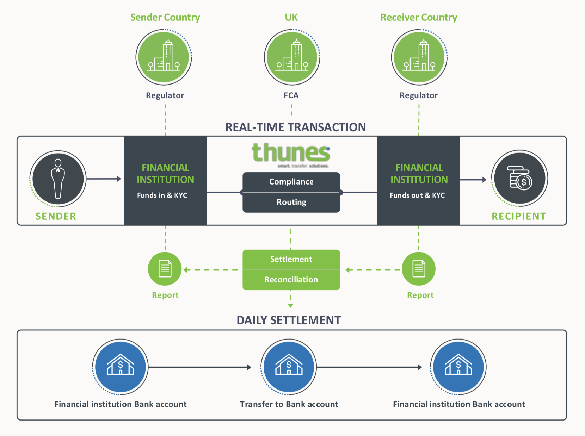
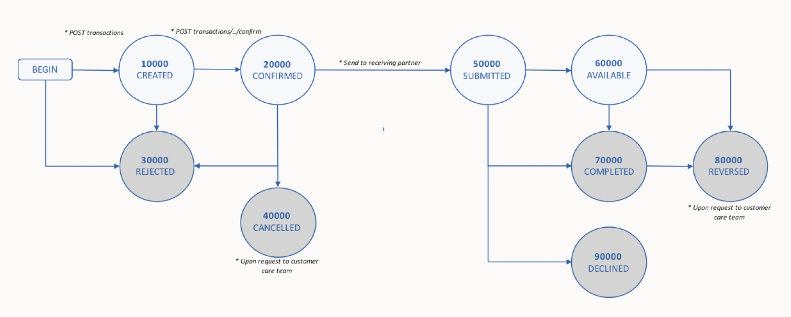
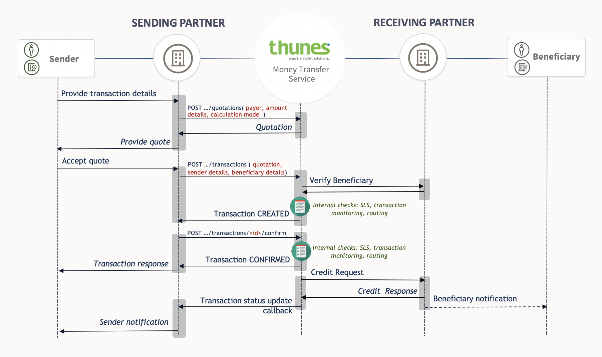

<!-- Start Introduction -->
<h1 id="introduction">Introduction</h1>

<blockquote>

</blockquote>

Welcome to the Money Transfer API reference.

This API serves as the primary gateway to facilitate money transfers through Thunes&rsquo; platform.

The Money Transfer API is organized according to <a href="https://en.wikipedia.org/wiki/Representational_state_transfer">REST</a> principles and provides the following functionalities:

<ul>
<li>Process and retrieve transaction details</li>
<li>Account management services</li>
<li>Discovery services</li>
</ul>

<h2 id="environments">Environments</h2>

This API is available in 2 environments: production and pre-production, reachable via IPSec VPN or HTTPS.

Specific details relating to the endpoints will be provided upon account creation.

<!-- End Introduction -->

<h1 id="transaction-states">Transaction states</h1>

<blockquote>

</blockquote>

During the course of a transfer, a transaction will undergo various status changes as illustrated.

Conditions marked as &ldquo;Upon request to customer care team&rdquo; pertains to reversal and/or cancellation, which must be requested through and performed by Thunes’ customer care team.

As changes in transaction status occur, updates will be sent in real-time when a callback URL is provided. In conjunction, transaction status can be queried through one of two means: via the returned <code>id</code> or a provided <code>external_id</code>.

The latter serves as a unique reference in the perspective of the sending partner and functions to retrieve transaction details when exceptions occur, such as when the supposed response was not received, as an example.

The numerical values within each of the illustrated states correspond to the <a href="#transaction-status">transaction status</a>, while the labels correspond to that of the <a href="#transaction-status-class">transaction status class message</a>.

<h1 id="example-flow">Example Flow</h1>

<blockquote>

</blockquote>

As soon as a transaction is confirmed, the transfer order will be sent to the receiving partner for immediate processing.

During this time, the sending partner will receive a <code>CONFIRMED</code> status for the transaction.

<h1 id="callback">Callback</h1>

<pre class="chroma"><code class="language-http" data-lang="http">POST /callback HTTP/1.1
Date: Wed, 02 Nov 2016 09:17:54 GMT
Content-Type: application/json
X-TransferTo-Apikey: 00000000-0000-0000-0000-000000000000
X-TransferTo-Nonce: 1478078334
X-TransferTo-Hmac: g41AgixMSFMQj0TZgyXIK6+odCVgy76fxfGpAtWwhE8=</code></pre>

<pre class="chroma"><code class="language-json" data-lang="json">{
   &#34;id&#34;: 1,
   &#34;status&#34;: 70000,
   &#34;status_message&#34;: &#34;COMPLETED&#34;,
   &#34;status_class&#34;: 7,
   &#34;status_class_message&#34;: &#34;COMPLETED&#34;,
   &#34;external_id&#34;: &#34;1478078339357&#34;,
   &#34;external_code&#34;: null,
   &#34;payer_transaction_reference&#34;: &#34;SP-000-123&#34;,
   &#34;payer_transaction_code&#34;: &#34;SP-ABC-DEF&#34;,
   &#34;creation_date&#34;: &#34;2016-11-02T09:19:15&#34;,
   &#34;expiration_date&#34;: &#34;2016-11-03T09:07:44&#34;,
   &#34;credit_party_identifier&#34;: {
      &#34;msisdn&#34;: &#34;+263775892100&#34;,
      &#34;bank_account_number&#34;: &#34;0123456789&#34;,
      &#34;swift_bic_code&#34;: &#34;ABCDEFGH&#34;
   },
   &#34;source&#34;: {
      &#34;country_iso_code&#34;: &#34;FRA&#34;,
      &#34;currency&#34;: &#34;EUR&#34;,
      &#34;amount&#34;: 10
   },
   &#34;destination&#34;: {
      &#34;currency&#34;: &#34;USD&#34;,
      &#34;amount&#34;: 10.69
   },
   &#34;payer&#34;: {
      &#34;id&#34;: 1,
      &#34;name&#34;: &#34;Sample Payer&#34;,
      &#34;precision&#34;: 2,
      &#34;increment&#34;: 0.01,
      &#34;currency&#34;: &#34;USD&#34;,
      &#34;country_iso_code&#34;: &#34;ZWE&#34;,
      &#34;minimum_transaction_amount&#34;: 0,
      &#34;maximum_transaction_amount&#34;: null,
      &#34;credit_party_identifiers_accepted&#34;: [
         [
            &#34;msisdn&#34;
         ]
      ],
      &#34;required_sender_fields&#34;: [
         [
            &#34;lastname&#34;,
            &#34;firstname&#34;
         ]
      ],
      &#34;required_beneficiary_fields&#34;: [
         [
            &#34;lastname&#34;,
            &#34;firstname&#34;
         ]
      ],
      &#34;service&#34;: {
         &#34;id&#34;: 1,
         &#34;name&#34;: &#34;MobileWallet&#34;
      },
      &#34;credit_party_information&#34;: {
         &#34;credit_party_identifiers_accepted&#34;: [
            []
         ]
      },
      &#34;credit_party_verification&#34;: {
         &#34;credit_party_identifiers_accepted&#34;: [
            []
         ],
         &#34;required_beneficiary_fields&#34;: [
            []
         ]
      }
   },
   &#34;sender&#34;: {
      &#34;lastname&#34;: &#34;Doe&#34;,
      &#34;lastname2&#34;: null,
      &#34;middlename&#34;: null,
      &#34;firstname&#34;: &#34;John&#34;,
      &#34;nativename&#34;: null,
      &#34;nationality_country_iso_code&#34;: &#34;FRA&#34;,
      &#34;code&#34;: null,
      &#34;date_of_birth&#34;: &#34;1970-01-01&#34;,
      &#34;country_of_birth_iso_code&#34;: &#34;FRA&#34;,
      &#34;gender&#34;: &#34;MALE&#34;,
      &#34;address&#34;: &#34;42 Rue des fleurs&#34;,
      &#34;postal_code&#34;: &#34;75000&#34;,
      &#34;city&#34;: &#34;Paris&#34;,
      &#34;country_iso_code&#34;: &#34;FRA&#34;,
      &#34;msisdn&#34;: &#34;33712345678&#34;,
      &#34;email&#34;: &#34;john.doe@mail.com&#34;,
      &#34;id_type&#34;: &#34;SOCIAL_SECURITY&#34;,
      &#34;id_country_iso_code&#34;: null,
      &#34;id_number&#34;: &#34;502-42-0158&#34;,
      &#34;id_delivery_date&#34;: &#34;2016-01-01&#34;,
      &#34;id_expiration_date&#34;: null,
      &#34;occupation&#34;: &#34;Residential Advisor&#34;,
      &#34;bank&#34;: null,
      &#34;bank_account&#34;: null,
      &#34;card&#34;: null,
      &#34;province_state&#34;: null,
      &#34;beneficiary_relationship&#34;: null,
      &#34;source_of_funds&#34;: null
   },
   &#34;beneficiary&#34;: {
      &#34;lastname&#34;: &#34;Doe&#34;,
      &#34;lastname2&#34;: null,
      &#34;middlename&#34;: null,
      &#34;firstname&#34;: &#34;Jane&#34;,
      &#34;nativename&#34;: null,
      &#34;nationality_country_iso_code&#34;: &#34;FRA&#34;,
      &#34;code&#34;: null,
      &#34;date_of_birth&#34;: &#34;1971-01-01&#34;,
      &#34;country_of_birth_iso_code&#34;: &#34;ZWE&#34;,
      &#34;gender&#34;: &#34;MALE&#34;,
      &#34;address&#34;: &#34;3 Norfolk Road&#34;,
      &#34;postal_code&#34;: &#34;4581&#34;,
      &#34;city&#34;: &#34;Harare&#34;,
      &#34;country_iso_code&#34;: &#34;ZWE&#34;,
      &#34;msisdn&#34;: &#34;263775892364&#34;,
      &#34;email&#34;: &#34;jane.doe@mail.com&#34;,
      &#34;id_type&#34;: &#34;SOCIAL_SECURITY&#34;,
      &#34;id_country_iso_code&#34;: &#34;ZWE&#34;,
      &#34;id_number&#34;: &#34;178027317681327&#34;,
      &#34;id_delivery_date&#34;: null,
      &#34;id_expiration_date&#34;: null,
      &#34;occupation&#34;: &#34;Sales Executive&#34;,
      &#34;bank_account_holder_name&#34;: null,
      &#34;province_state&#34;: null
   },
   &#34;callback_url&#34;: &#34;{URL_PLACEHOLDER}&#34;,
   &#34;sent_amount&#34;: {
      &#34;currency&#34;: &#34;EUR&#34;,
      &#34;amount&#34;: 10
   },
   &#34;wholesale_fx_rate&#34;: 1.06891969534071,
   &#34;retail_rate&#34;: null,
   &#34;retail_fee&#34;: 1,
   &#34;retail_fee_currency&#34;: &#34;EUR&#34;,
   &#34;fee&#34;: {
      &#34;currency&#34;: &#34;EUR&#34;,
      &#34;amount&#34;: 1.88
   },
   &#34;purpose_of_remittance&#34;: &#34;FAMILY_SUPPORT&#34;,
   &#34;additional_information_1&#34;: null,
   &#34;additional_information_2&#34;: null,
   &#34;additional_information_3&#34;: null
}</code></pre>

As the transfer order is being processed, changes in status will be notified in realtime if a callback URL was provided.

This endpoint must be implemented by the sending partner, which should expect an HTTP <code>POST</code> request containing a <a href="#transaction">transaction</a> object represented in JSON.

The same sets of credentials used to access the Money Transfer API will be used in authenticating to the callback endpoint, via <a href="#digest-auth">digest auth</a>.

Upon sucessful receipt of data, the callback endpoint should respond with an HTTP <code>2XX</code>. In the event that the Money Transfer platform did not receive this response, callback notifications will be retried several times, beyond which, the transaction status will have to be queried by the sending partner.

 

<h1 id="authentication">Authentication</h1>

Access to all endpoints of the API requires authentication, through one of the following means:

<ol>
<li><a href="https://en.wikipedia.org/wiki/Basic_access_authentication">HTTP Basic Auth</a></li>
<li><a href="https://en.wikipedia.org/wiki/Digest_access_authentication">Digest Auth</a> (<a href="https://en.wikipedia.org/wiki/Hash-based_message_authentication_code">HMAC</a>)</li>
</ol>

<h2 id="basic-auth">Basic Auth</h2>

<pre class="chroma"><code class="language-shell" data-lang="shell">curl https://api.mm.thunes.com/ping \
  -u &#34;${API_KEY}:${API_SECRET}&#34;</code></pre>

<table>
<thead>
<tr>
<th>URL Part</th>
<th>Value</th>
</tr>
</thead>

<tbody>
<tr>
<td>username</td>
<td>API key</td>
</tr>

<tr>
<td>password</td>
<td>API secret</td>
</tr>
</tbody>
</table>

> To authorize, use this code:

<h1 id="errors">Errors</h1>

<h2 id="http-response">HTTP Response</h2>

<pre class="chroma"><code class="language-http" data-lang="http">HTTP/1.1 401 Unauthorized</code></pre>

<pre class="chroma"><code class="language-json" data-lang="json">{
    &#34;errors&#34;: [
        {
            &#34;code&#34;: &#34;1000401&#34;,
            &#34;message&#34;: &#34;Unauthorized&#34;
        }
    ]
}</code></pre>

Thunes uses standard HTTP response codes to indicate whether an API request is successful or not.

<table>
<thead>
<tr>
<th>Status</th>
<th>Description</th>
</tr>
</thead>

<tbody>
<tr>
<td><code>200</code></td>
<td>OK</td>
</tr>

<tr>
<td><code>400</code></td>
<td>Bad Request: Request was malformed</td>
</tr>

<tr>
<td><code>401</code></td>
<td>Unauthorized: Credentials missing or invalid</td>
</tr>

<tr>
<td><code>404</code></td>
<td>Not Found: Resource doesn&rsquo;t exist</td>
</tr>

<tr>
<td><code>500</code></td>
<td>Server Error: Error occurred on Thunes</td>
</tr>
</tbody>
</table>

Details will always be contained within the HTTP body.

<h2 id="api-error-codes">API Error Codes</h2>

<table>
<thead>
<tr>
<th>Code</th>
<th>Description</th>
</tr>
</thead>

<tbody>
<tr>
<td><code>1000401</code></td>
<td>Unauthorized</td>
</tr>

<tr>
<td><code>1000404</code></td>
<td>Resource not found</td>
</tr>

<tr>
<td><code>1000999</code></td>
<td>Invalid parameter</td>
</tr>

<tr>
<td><code>1000998</code></td>
<td>Source country not authorized</td>
</tr>

<tr>
<td><code>1003001</code></td>
<td>Payer is inactive in your account</td>
</tr>

<tr>
<td><code>1003002</code></td>
<td>Invalid payer</td>
</tr>

<tr>
<td><code>1003007</code></td>
<td>Payer is currently unavailable</td>
</tr>

<tr>
<td><code>1003008</code></td>
<td>Destination amount is invalid</td>
</tr>

<tr>
<td><code>1003009</code></td>
<td>Parameter page is outside of the page range</td>
</tr>

<tr>
<td><code>1003010</code></td>
<td>Destination currency not provided by payer</td>
</tr>

<tr>
<td><code>1003011</code></td>
<td>Transaction amount below minimum of the selected payer</td>
</tr>

<tr>
<td><code>1003012</code></td>
<td>Transaction amount over maximum of the selected payer</td>
</tr>

<tr>
<td><code>1005001</code></td>
<td>Account is invalid</td>
</tr>

<tr>
<td><code>1007001</code></td>
<td>External ID has already been used</td>
</tr>

<tr>
<td><code>1007002</code></td>
<td>Transaction has already been confirmed</td>
</tr>

<tr>
<td><code>1007003</code></td>
<td>Transaction can not be confirmed</td>
</tr>

<tr>
<td><code>1007004</code></td>
<td>Transaction can no longer be confirmed, quotation has expired</td>
</tr>

<tr>
<td><code>1007100</code></td>
<td>Method is not supported by this payer</td>
</tr>

<tr>
<td><code>1007101</code></td>
<td>Method is currently unavailable</td>
</tr>

<tr>
<td><code>1008002</code></td>
<td>Quotation not found</td>
</tr>

<tr>
<td><code>1008003</code></td>
<td>Quotation has expired</td>
</tr>

<tr>
<td><code>1008004</code></td>
<td>Transaction not found</td>
</tr>

<tr>
<td><code>1009001</code></td>
<td>Unexpected error, please contact our support team</td>
</tr>
</tbody>
</table>

<h1 id="pagination">Pagination</h1>

<pre class="chroma"><code class="language-http" data-lang="http">GET /{resource}?page=1&amp;per_page=50 HTTP/1.1
X-Total: 1
X-Total-Pages: 1
X-Per-Page: 50
X-Page: 1</code></pre>

API resources supporting bulk fetches via &ldquo;list&rdquo; API methods will be returned in a paginated fashion.

<h2 id="input-parameters">Input Parameters</h2>

<table>
<thead>
<tr>
<th>Field</th>
<th>Required</th>
<th>Type</th>
<th>Description</th>
</tr>
</thead>

<tbody>
<tr>
<td><code>page</code></td>
<td>No</td>
<td>Integer</td>
<td>Page number</td>
</tr>

<tr>
<td><code>per_page</code></td>
<td>No</td>
<td>Integer</td>
<td>Number of results per page (default 50, max 100)</td>
</tr>
</tbody>
</table>

<h1 id="connectivity">Connectivity</h1>

<h2 id="ping">Ping</h2>

<pre class="chroma"><code class="language-http" data-lang="http">GET /ping HTTP/1.1
200 OK</code></pre>

<pre class="chroma"><code class="language-json" data-lang="json">{
   &#34;status&#34;: &#34;up&#34;
}</code></pre>

<api><code>GET /ping</code></api>

Query API status.

<h4 id="output">Output</h4>

<table>
<thead>
<tr>
<th>Field</th>
<th>Type</th>
<th>Description</th>
</tr>
</thead>

<tbody>
<tr>
<td><code>status</code></td>
<td>String</td>
<td>API status</td>
</tr>
</tbody>
</table>

Expected value of <code>status</code> should be &ldquo;up&rdquo;.

<h1 id="discovery">Discovery</h1>

<h2 id="services">Services</h2>

<pre class="chroma"><code class="language-http" data-lang="http">GET /v1/money-transfer/services HTTP/1.1
X-Total: 1
X-Total-Pages: 1
X-Per-Page: 50
X-Page: 1
200 OK</code></pre>

<pre class="chroma"><code class="language-json" data-lang="json">[
   {
      &#34;id&#34;: 1,
      &#34;name&#34;: &#34;MobileWallet&#34;
   },
   {
      &#34;id&#34;: 2,
      &#34;name&#34;: &#34;BankAccount&#34;
   },
   {
      &#34;id&#34;: 3,
      &#34;name&#34;: &#34;CashPickup&#34;
   }
]</code></pre>

<api><code>GET /v1/money-transfer/services</code></api>

Retrieve list of all available services.

<h4 id="input">Input</h4>

<table>
<thead>
<tr>
<th>Field</th>
<th>Required</th>
<th>Type</th>
<th>Description</th>
</tr>
</thead>

<tbody>
<tr>
<td><code>page</code></td>
<td>No</td>
<td>Integer</td>
<td>Page number</td>
</tr>

<tr>
<td><code>per_page</code></td>
<td>No</td>
<td>Integer</td>
<td>Number of results per page (default 50, max 100)</td>
</tr>

<tr>
<td><code>country_iso_code</code></td>
<td>No</td>
<td>String</td>
<td>Country code in <a href="https://en.wikipedia.org/wiki/ISO_3166-1_alpha-3">ISO 3166-1 alpha-3</a> format</td>
</tr>
</tbody>
</table>

<h4 id="output-1">Output</h4>

Array of <a href="#service">service</a> objects in a <a href="#pagination">paginated</a> fashion.

<h2 id="payers">Payers</h2>

<pre class="chroma"><code class="language-http" data-lang="http">GET /v1/money-transfer/payers HTTP/1.1
X-Total: 1
X-Total-Pages: 1
X-Per-Page: 50
X-Page: 1
200 OK</code></pre>

<pre class="chroma"><code class="language-json" data-lang="json">[
   {
      &#34;id&#34;: 1,
      &#34;name&#34;: &#34;MobileWallet Payer&#34;,
      &#34;precision&#34;: 2,
      &#34;increment&#34;: 0.01,
      &#34;currency&#34;: &#34;USD&#34;,
      &#34;country_iso_code&#34;: &#34;USA&#34;,
      &#34;minimum_transaction_amount&#34;: 0,
      &#34;maximum_transaction_amount&#34;: null,
      &#34;service&#34;: {
         &#34;id&#34;: 1,
         &#34;name&#34;: &#34;MobileWallet&#34;
      },
      &#34;credit_party_identifiers_accepted&#34;: [
         [
            &#34;msisdn&#34;
         ]
      ],
      &#34;required_sender_fields&#34;: [
         [
            &#34;firstname&#34;,
            &#34;lastname&#34;,
            &#34;date_of_birth&#34;
         ]
      ],
      &#34;required_beneficiary_fields&#34;: [
         [
            &#34;firstname&#34;,
            &#34;lastname&#34;
         ]
      ],
      &#34;credit_party_information&#34;: {
         &#34;credit_party_identifiers_accepted&#34;: [
            []
         ]
      },
      &#34;credit_party_verification&#34;: {
         &#34;credit_party_identifiers_accepted&#34;: [
            []
         ],
         &#34;required_beneficiary_fields&#34;: [
            []
         ]
      }
   },
   {
      &#34;id&#34;: 2,
      &#34;name&#34;: &#3#34;CashPickup Payer&#34;,
      &#34;precision&#34;: 2,
      &#34;increment&#34;: 0.01,
      &#34;currency&#34;: &#34;PHP&#34;,
      &#34;country_iso_code&#34;: &#34;PHL&#34;,
      &#34;minimum_transaction_amount&#34;: 0,
      &#34;maximum_transaction_amount&#34;: null,
      &#34;service&#34;: {
         &#34;name&#34;: &#34;CashPickup&#34;,
         &#34;id&#34;: 3
      },
      &#34;credit_party_identifiers_accepted&#34;: [
         [
            &#34;msisdn&#34;
         ]
      ],
      &#34;required_sender_fields&#34;: [
         [
            &#34;firstname&#34;,
            &#34;lastname&#34;,
            &#34;date_of_birth&#34;
         ]
      ],
      &#34;required_beneficiary_fields&#34;: [
         [
            &#34;firstname&#34;,
            &#34;lastname&#34;
         ]
      ],
      &#34;credit_party_information&#34;: {
         &#34;credit_party_identifiers_accepted&#34;: [
            []
         ]
      },
      &#34;credit_party_verification&#34;: {
         &#34;credit_party_identifiers_accepted&#34;: [
            []
         ],
         &#34;required_beneficiary_fields&#34;: [
            []
         ]
      }
   }
]</code></pre>

<api><code>GET /v1/money-transfer/payers</code></api>

Retrieve information for all payers available for a given account, optionally filtered based on specified parameters.

<h4 id="input-1">Input</h4>

<table>
<thead>
<tr>
<th>Field</th>
<th>Required</th>
<th>Type</th>
<th>Description</th>
</tr>
</thead>

<tbody>
<tr>
<td><code>page</code></td>
<td>No</td>
<td>Integer</td>
<td>Page number</td>
</tr>

<tr>
<td><code>per_page</code></td>
<td>No</td>
<td>Integer</td>
<td>Number of results per page (default 50, max 100)</td>
</tr>

<tr>
<td><code>service_id</code></td>
<td>No</td>
<td>Integer</td>
<td><a href="#service">Service ID</a></td>
</tr>

<tr>
<td><code>country_iso_code</code></td>
<td>No</td>
<td>String</td>
<td>Country code in <a href="https://en.wikipedia.org/wiki/ISO_3166-1_alpha-3">ISO 3166-1 alpha-3</a> format</td>
</tr>

<tr>
<td><code>currency</code></td>
<td>No</td>
<td>String</td>
<td>Currency in <a href="https://en.wikipedia.org/wiki/ISO_4217">ISO 4217</a> format</td>
</tr>
</tbody>
</table>

<h4 id="output-2">Output</h4>

Array of <a href="#payer">payer</a> objects in a <a href="#pagination">paginated</a> fashion.

&ndash;

<pre class="chroma"><code class="language-http" data-lang="http">GET /v1/money-transfer/payers/3 HTTP/1.1
200 OK</code></pre>

<pre class="chroma"><code class="language-json" data-lang="json">{
    &#34;id&#34;: 3,
    &#34;name&#34;: &#34;Sample Payer&#34;,
    &#34;precision&#34;: 0,
    &#34;increment&#34;: 0.01,
    &#34;currency&#34;: &#34;IDR&#34;,
    &#34;country_iso_code&#34;: &#34;IDN&#34;,
    &#34;minimum_transaction_amount&#34;: 0,
    &#34;maximum_transaction_amount&#34;: null,
    &#34;service&#34;: {
         &#34;id&#34;: 1,
         &#34;name&#34;: &#34;MobileWallet&#34;
    },
    &#34;credit_party_identifiers_accepted&#34;: [
         [
                &#34;msisdn&#34;
         ]
    ],
    &#34;required_sender_fields&#34;: [
         [
                &#34;firstname&#34;,
                &#34;date_of_birth&#34;,
                &#34;lastname&#34;
         ]
    ],
    &#34;required_beneficiary_fields&#34;: [
         [
                &#34;firstname&#34;,
                &#34;lastname&#34;
         ]
    ],
    &#34;credit_party_information&#34;: {
        &#34;credit_party_identifiers_accepted&#34;: [
            []
        ]
    },
    &#34;credit_party_verification&#34;: {
        &#34;credit_party_identifiers_accepted&#34;: [
            []
        ],
        &#34;required_beneficiary_fields&#34;: [
            []
        ]
    }
}</code></pre>

<api><code>GET /v1/money-transfer/payers/{id}</code></api>

Retrieve information for a given <a href="#payer">payer</a>.

<h4 id="output-3">Output</h4>

<a href="#payer">Payer</a> object.

<h2 id="payer-rates">Payer Rates</h2>

<pre class="chroma"><code class="language-http" data-lang="http">GET /v1/money-transfer/payers/362/rates HTTP/1.1
200 OK</code></pre>

<pre class="chroma"><code class="language-json" data-lang="json">{
    &#34;destination_currency&#34;: &#34;CUC&#34;,
    &#34;rates&#34;: {
        &#34;EUR&#34;: [
            {
                &#34;source_amount_min&#34;: 0,
                &#34;source_amount_max&#34;: 88,
                &#34;wholesale_fx_rate&#34;: 1.10847692409526
            },
            {
                &#34;source_amount_min&#34;: 88,
                &#34;source_amount_max&#34;: 8800,
                &#34;wholesale_fx_rate&#34;: 1.10847692409526
            }
        ]
    }
}</code></pre>

<api><code>GET /v1/money-transfer/payers/{id}/rates</code></api>

Retrieve <a href="#rates">rates</a> under a given <a href="#payer">payer</a>.

<h4 id="output-4">Output</h4>

<table>
<thead>
<tr>
<th>Field</th>
<th>Type</th>
<th>Description</th>
</tr>
</thead>

<tbody>
<tr>
<td><code>destination_currency</code></td>
<td>String</td>
<td>Currency in <a href="https://en.wikipedia.org/wiki/ISO_4217">ISO 4217</a> format</td>
</tr>

<tr>
<td><code>rates</code></td>
<td>Object</td>
<td><a href="#rates">Rates</a> information</td>
</tr>
</tbody>
</table>

<h2 id="countries">Countries</h2>

<pre class="chroma"><code class="language-http" data-lang="http">GET /v1/money-transfer/countries HTTP/1.1
X-Total: 1
X-Total-Pages: 1
X-Per-Page: 50
X-Page: 1
200 OK</code></pre>

<pre class="chroma"><code class="language-json" data-lang="json">[
    {
        &#34;iso_code&#34;: &#34;KEN&#34;,
        &#34;name&#34;: &#34;Kenya&#34;
    }
]</code></pre>

<api><code>GET /v1/money-transfer/countries</code></api>

Retrieve list of <a href="#country">countries</a> for all money transfer <a href="#services">services</a> available for a given account.

<h4 id="input-2">Input</h4>

<table>
<thead>
<tr>
<th>Field</th>
<th>Required</th>
<th>Type</th>
<th>Description</th>
</tr>
</thead>

<tbody>
<tr>
<td><code>page</code></td>
<td>No</td>
<td>Integer</td>
<td>Page number</td>
</tr>

<tr>
<td><code>per_page</code></td>
<td>No</td>
<td>Integer</td>
<td>Number of results per page (default 50, max 100)</td>
</tr>
</tbody>
</table>

<h4 id="output-5">Output</h4>

Array of <a href="#country">country</a> objects in a paginated fashion.

<h1 id="account">Account</h1>

<h2 id="balances">Balances</h2>

<pre class="chroma"><code class="language-http" data-lang="http">GET /v1/money-transfer/balances HTTP/1.1
X-Total: 1
X-Total-Pages: 1
X-Per-Page: 50
X-Page: 1
200 OK</code></pre>

<pre class="chroma"><code class="language-json" data-lang="json">[
    {
        &#34;id&#34;: 1,
        &#34;currency&#34;: &#34;EUR&#34;,
        &#34;balance&#34;: 10000000,
        &#34;available_balance&#34;: 10000000,
        &#34;credit_facility&#34;: 0
    }
]</code></pre>

<api><code>GET /v1/money-transfer/balances</code></api>

Retrieve information for all account balances per currency.

<h4 id="input-13">Input</h4>

<table>
<thead>
<tr>
<th>Field</th>
<th>Required</th>
<th>Type</th>
<th>Description</th>
</tr>
</thead>

<tbody>
<tr>
<td><code>page</code></td>
<td>No</td>
<td>Integer</td>
<td>Page number</td>
</tr>

<tr>
<td><code>per_page</code></td>
<td>No</td>
<td>Integer</td>
<td>Number of results per page (default 50, max 100)</td>
</tr>
</tbody>
</table>

<h4 id="output-20">Output</h4>

Array of <a href="#balance">balance</a> objects.

