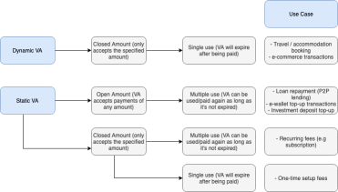

## VA Payment Flow

Users will be able to pay into a Virtual Account through ATM, Mobile Banking, and Internet Banking.

<h3 id="key-features-api-va-aggregator" type="normal">Key Features</h3>
<ol>
<li><strong>Support multiple banks</strong> - Currently, we support virtual accounts (VA) at 6 banks: BCA, BNI, Mandiri, BRI, Permata, and CIMB Niaga</li>
<li><strong>Real-time settlement for majority of the banks</strong> - Payment into a VA will settle in your Transfez B2B dashboard on a real-time basis for the majority of the banks</li>
<li><strong>Transaction tracking and monitoring capability</strong> - You can track all created VA, incoming payments, and their respective details through our API callback or the Transfez B2B dashboard. You will receive a callback all incoming transactions.</li>
<li><strong>Customizable VA types</strong> - Refer to the table below for more informations on various types of VA:</li>
</ol>
<table><thead>
<tr>
<th>Type/Feature</th>
<th>Description</th>
</tr>
</thead><tbody>
<tr>
<td>Static Virtual Account</td>
<td>VA that has a lifetime validity. It will always be active until it is manually deactivated</td>
</tr>
<tr>
<td>Dynamic Virtual Account</td>
<td>VA that has a specific validity period. It will always be active until it is expired or manually deactivated</td>
</tr>
<tr>
<td>Closed Amount Virtual Account</td>
<td>VA that only accepts payment of a specific amount/declared amount</td>
</tr>
<tr>
<td>Opened Amount Virtual Account</td>
<td>VA that accepts payment of any amount</td>
</tr>
<tr>
<td>Single Use Virtual Account</td>
<td>VA that expires after a single payment. A single use configuration set up for both dynamic and static VA</td>
</tr>
<tr>
<td>Multiple Use Virtual Account</td>
<td>VA that only expires when expiration date is reached or when it is manually deactivated</td>
</tr>
</tbody></table>
<h3 id="use-cases-api-va-aggregator" type="normal">Use Cases</h3>

